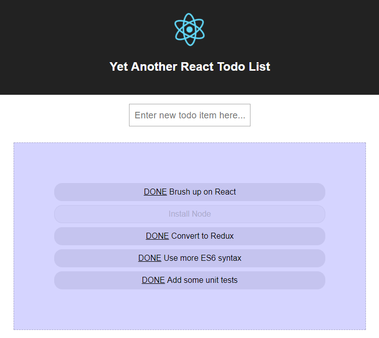

# Yet Another React.js Todo List

I first used React a few years ago, not long after it was first introduced. This was on an ES5 project without Flux/Redux.

Things have naturally moved on since then, hence this simple Todo list demo will be my scratchpad for brushing up with ES6 and Redux.

